

  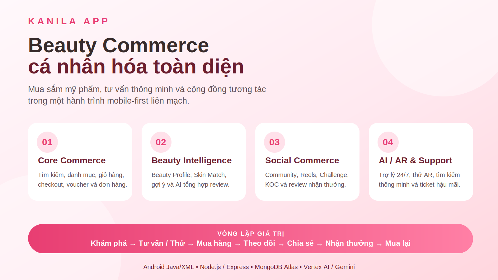

# KANILA APP

### Ứng dụng thương mại điện tử mỹ phẩm tích hợp cá nhân hóa, cộng đồng tương tác và trợ lý hỗ trợ khách hàng thông minh

## **Chọn đúng hơn · Mua dễ hơn · Đẹp theo cách của bạn**

Kanila biến hành trình mua mỹ phẩm trực tuyến từ việc **tìm kiếm và đặt hàng** thành một trải nghiệm hoàn chỉnh: **hiểu làn da – khám phá sản phẩm – nhận tư vấn – mua sắm – chia sẻ – nhận thưởng – quay lại**.

---

## Kanila là gì?

**Kanila App** là ứng dụng mua sắm mỹ phẩm trên thiết bị di động, được phát triển theo định hướng **Beauty Commerce** — kết hợp thương mại điện tử, tư vấn làm đẹp cá nhân hóa, nội dung cộng đồng và hỗ trợ khách hàng trong cùng một nền tảng.

Thay vì chỉ hiển thị sản phẩm và giá bán, Kanila hướng đến việc giúp người dùng trả lời những câu hỏi quan trọng trước khi mua:

> **Sản phẩm này có phù hợp với làn da, nhu cầu, phong cách trang điểm và ngân sách của mình không?**

Từ đó, ứng dụng giúp giảm cảm giác phân vân khi mua mỹ phẩm online, tăng sự tự tin trong lựa chọn và xây dựng mối quan hệ lâu dài giữa người dùng với thương hiệu.

---

## Điểm nổi bật

| | Tính năng | Giá trị mang lại |
|---:|---|---|
| 💗 | **Beauty Profile** | Ghi nhận loại da, vấn đề da, tone da, sở thích, thành phần cần tránh và mục tiêu làm đẹp để cá nhân hóa trải nghiệm. |
| ✨ | **Gợi ý sản phẩm phù hợp** | Ưu tiên những sản phẩm phù hợp hơn với hồ sơ và nhu cầu thực tế của từng người dùng. |
| 🤖 | **Trợ lý Kanila** | Hỗ trợ tư vấn sản phẩm, giải đáp thắc mắc, tra cứu đơn hàng và kết nối chăm sóc khách hàng. |
| 💄 | **AR Try-On** | Hướng đến trải nghiệm thử màu son, má và mắt trước khi quyết định mua. |
| 👥 | **Community & Reels** | Không gian chia sẻ review, bí quyết làm đẹp, video ngắn, thử thách và nội dung gắn với sản phẩm. |
| 🎁 | **Loyalty & Reward** | Khuyến khích người dùng mua sắm, đánh giá, tham gia cộng đồng và quay lại thông qua điểm thưởng, voucher và quyền lợi thành viên. |

---

## Giao diện Kanila

  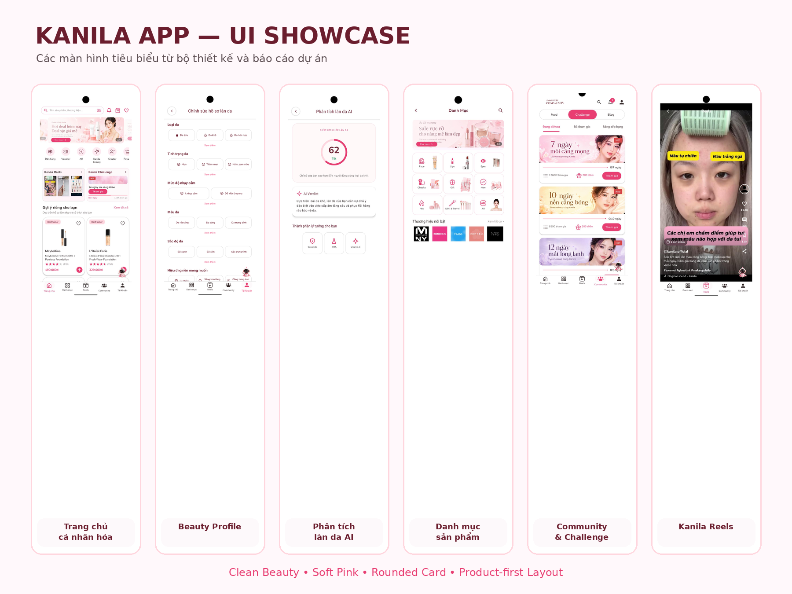

Kanila sử dụng phong cách **Clean Beauty** với nền sáng, sắc hồng mềm mại, card bo góc và bố cục ưu tiên hình ảnh sản phẩm. Mỗi màn hình tập trung vào một mục tiêu rõ ràng để người dùng dễ khám phá, lựa chọn và hoàn thành hành động.

---

## Một hành trình liền mạch

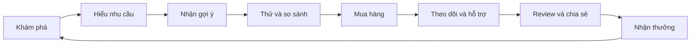

Kanila được thiết kế để đồng hành với người dùng **trước, trong và sau khi mua hàng**, thay vì kết thúc trải nghiệm ngay sau bước thanh toán.

---

## Không chỉ là một app bán mỹ phẩm

### 1. Mua sắm thuận tiện

Người dùng có thể tìm kiếm, lọc sản phẩm, xem chi tiết, lựa chọn phiên bản, lưu yêu thích, áp dụng voucher, thanh toán và theo dõi đơn hàng ngay trên ứng dụng.

### 2. Hiểu người dùng để tư vấn tốt hơn

Beauty Profile trở thành nền tảng cho các nội dung và sản phẩm được ưu tiên hiển thị. Trải nghiệm vì vậy gần với một chuyên viên tư vấn cá nhân hơn là một danh mục bán hàng đại trà.

### 3. Cộng đồng tạo cảm hứng mua sắm

Community, Reels, Challenge và review giúp người dùng khám phá sản phẩm qua trải nghiệm thật, học hỏi cách sử dụng và kết nối với những người có cùng mối quan tâm.

### 4. Hỗ trợ xuyên suốt hành trình

Trợ lý Kanila và trung tâm hỗ trợ giúp người dùng giải đáp thắc mắc, kiểm tra đơn hàng, xử lý vấn đề thanh toán, đổi trả hoặc gửi yêu cầu hỗ trợ khi cần.

---

## Các khu vực chính

| Khu vực | Trải nghiệm chính |
|---|---|
| **Trang chủ** | Nội dung nổi bật, ưu đãi, gợi ý cá nhân hóa và sản phẩm nên khám phá. |
| **Danh mục & tìm kiếm** | Tìm sản phẩm theo tên, thương hiệu, nhóm mỹ phẩm, nhu cầu và đặc điểm phù hợp. |
| **Chi tiết sản phẩm** | Hình ảnh, biến thể, đánh giá, mức độ phù hợp, nội dung tư vấn và sản phẩm liên quan. |
| **Beauty Profile** | Quản lý thông tin làn da, sở thích trang điểm, mục tiêu làm đẹp và thành phần cần tránh. |
| **Community & Reels** | Xem và chia sẻ nội dung, tham gia thử thách, khám phá sản phẩm từ bài viết và video. |
| **Giỏ hàng & thanh toán** | Kiểm tra sản phẩm, voucher, địa chỉ, vận chuyển, phương thức thanh toán và tổng chi phí. |
| **Tài khoản & hỗ trợ** | Quản lý đơn hàng, wishlist, voucher, loyalty, hồ sơ cá nhân và yêu cầu hỗ trợ. |

---

## Một số màn hình tiêu biểu

<table>
  <tr>
    <td align="center">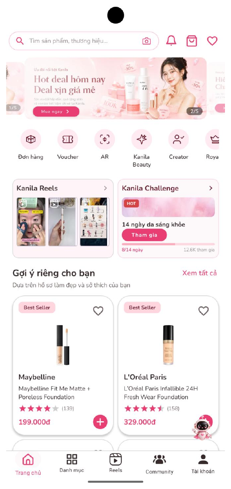 <b>Trang chủ cá nhân hóa</b></td>
    <td align="center">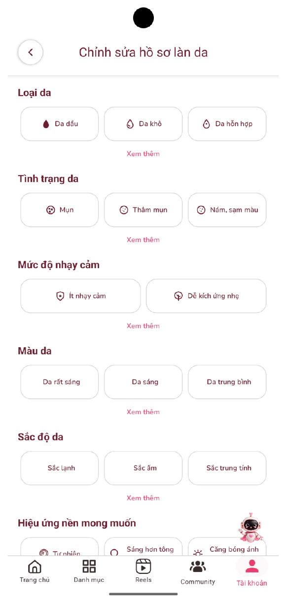 <b>Thiết lập Beauty Profile</b></td>
    <td align="center">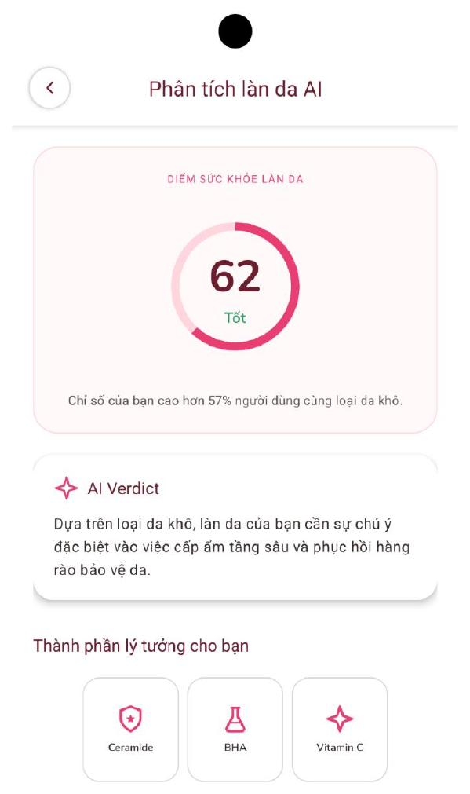 <b>Phân tích và gợi ý</b></td>
  </tr>
  <tr>
    <td align="center">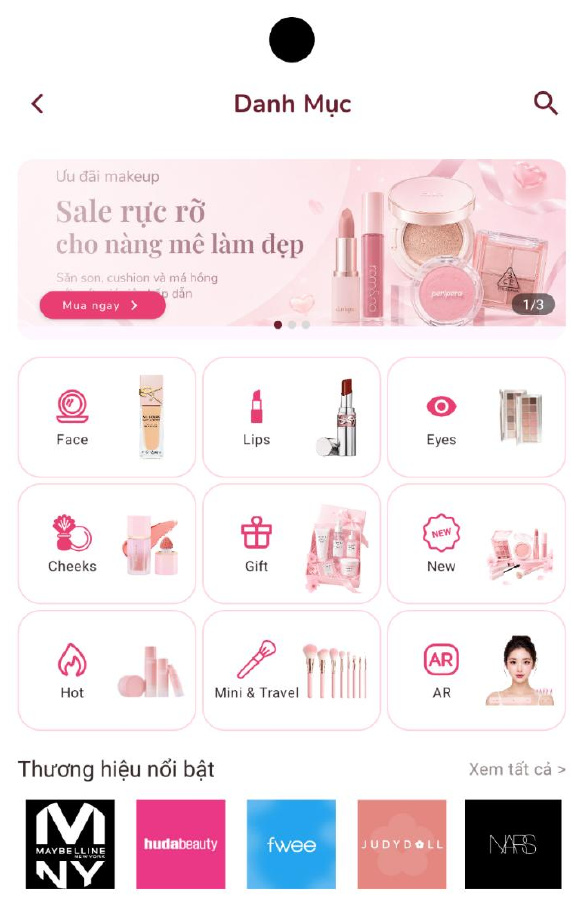 <b>Danh mục sản phẩm</b></td>
    <td align="center">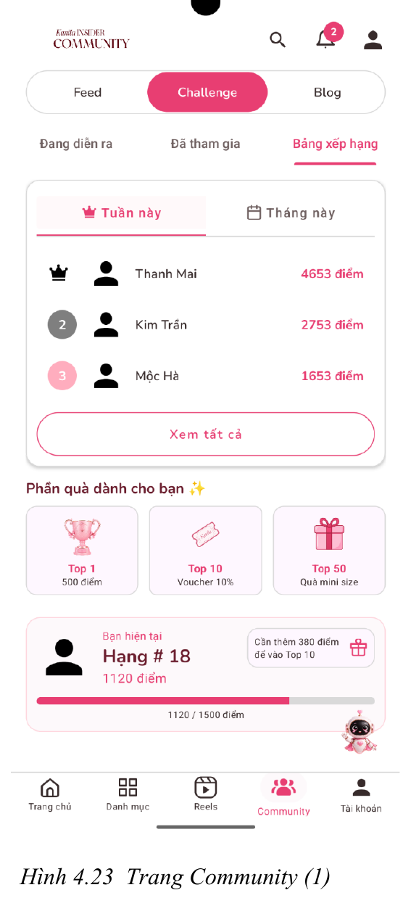 <b>Community Feed</b></td>
    <td align="center">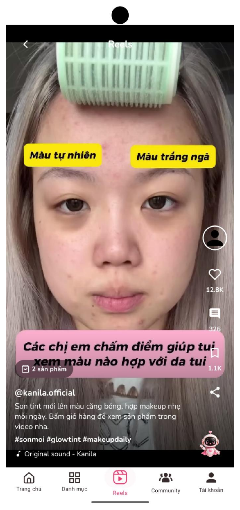 <b>Kanila Reels</b></td>
  </tr>
  <tr>
    <td align="center">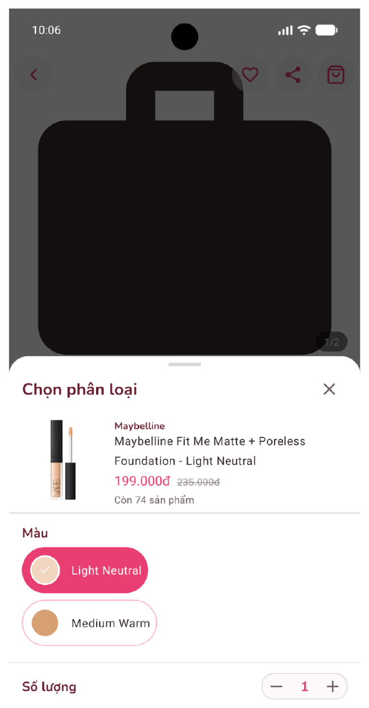 <b>Mua sắm sản phẩm</b></td>
    <td align="center">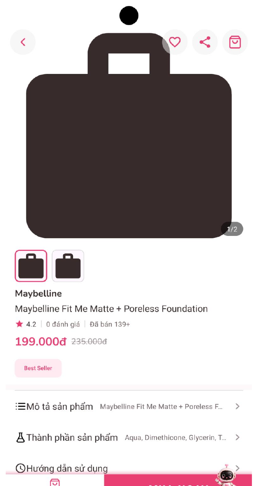 <b>Giỏ hàng</b></td>
    <td align="center">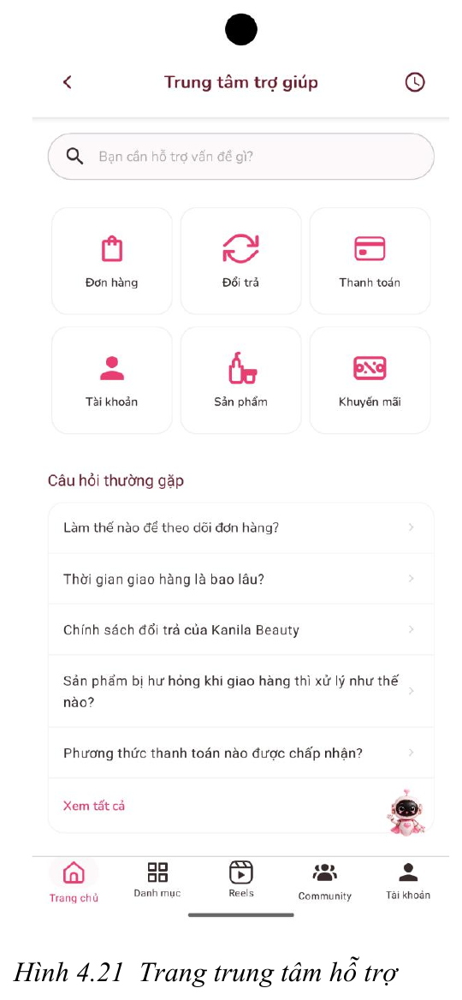 <b>Trung tâm hỗ trợ</b></td>
  </tr>
</table>

---

## Kanila dành cho ai?

- **Người mới bắt đầu chăm sóc da**, chưa biết nên chọn sản phẩm nào.
- **Người có làn da nhạy cảm hoặc nhiều mối quan tâm**, cần xem xét kỹ trước khi mua.
- **Người yêu thích makeup**, muốn khám phá màu sắc và phong cách mới.
- **Beauty lover**, thường xuyên xem review, theo dõi xu hướng và chia sẻ trải nghiệm.
- **Khách hàng trung thành**, muốn mua lại nhanh và nhận nhiều quyền lợi hơn.
- **Creator/KOC**, muốn xây dựng nội dung và kết nối sản phẩm với cộng đồng.

---

## Giá trị mang lại

### Đối với người dùng

- Dễ tìm được sản phẩm phù hợp hơn.
- Giảm rủi ro mua sai mỹ phẩm khi mua trực tuyến.
- Có thêm cơ sở để ra quyết định nhờ hồ sơ cá nhân, review và tư vấn.
- Được hỗ trợ xuyên suốt từ khám phá đến hậu mãi.
- Có không gian chia sẻ trải nghiệm và nhận phần thưởng từ hoạt động cộng đồng.

### Đối với doanh nghiệp

- Tăng khả năng chuyển đổi từ khám phá sang mua hàng.
- Xây dựng dữ liệu khách hàng phục vụ cá nhân hóa và chăm sóc dài hạn.
- Tạo thêm nội dung do người dùng đóng góp, tăng độ tin cậy cho sản phẩm.
- Tăng tỷ lệ quay lại thông qua loyalty, reward, community và gợi ý mua lại.
- Giảm áp lực cho bộ phận chăm sóc khách hàng nhờ trợ lý hỗ trợ và luồng xử lý rõ ràng.

---

## Định hướng phát triển

Kanila được xây dựng theo lộ trình từng bước:

| Giai đoạn | Trọng tâm |
|---|---|
| **Nền tảng** | Hoàn thiện mua sắm, giỏ hàng, thanh toán, đơn hàng, tài khoản và hỗ trợ. |
| **Cá nhân hóa** | Beauty Profile, gợi ý sản phẩm, mức độ phù hợp và hành trình chăm sóc da. |
| **Social Commerce** | Community, Reels, Challenge, review có thưởng và KOC/Creator. |
| **Trải nghiệm thông minh** | Trợ lý AI, thử mỹ phẩm bằng AR, tìm kiếm bằng giọng nói và hình ảnh. |

---

## Nền tảng phát triển

Kanila được phát triển cho **Android** với hệ thống quản lý dữ liệu và dịch vụ phía sau phục vụ thương mại điện tử, cá nhân hóa, cộng đồng và trợ lý thông minh.

---

## Bối cảnh đề tài

**Tên đề tài:**  
**Phát triển ứng dụng thương mại điện tử mỹ phẩm Kanila tích hợp cộng đồng tương tác và trợ lý hỗ trợ khách hàng thông minh**

- Trường Đại học Kinh tế – Luật, Đại học Quốc gia Thành phố Hồ Chí Minh
- Khoa Hệ thống Thông tin
- Học phần: Phát triển thương mại di động
- Học kỳ III, năm học 2025–2026

### Nhóm thực hiện

| Thành viên | Mã số sinh viên |
|---|---|
| Lê Thúy Thanh Trúc | K234111375 |
| Nguyễn Vũ Gia Ngân | K234111350 |
| Trịnh Thị Ngọc Ánh | K234111321 |
| Nguyễn Hoàng Gia Bảo | K234111323 |
| Nguyễn Minh Phú | K234111360 |

---

## Liên kết dự án

- **GitHub:** [trinhanh2604bn/KanilaApp](https://github.com/trinhanh2604bn/KanilaApp)
- **Figma:** [Kanila UI/UX Design](https://www.figma.com/design/mT3l8zt1q6uZaUtPjMIXS7/WEB?node-id=0-1&p=f&t=bm8NW73LKp5Bqj0i-0)
- **Draw.io:** [Sơ đồ phân tích và thiết kế](https://drive.google.com/file/d/1sM8nM9GUcP-g5L4Xoxd_6Mu4Zdl3vJxg/view?usp=sharing)
- **Project Drive:** [Tài liệu dự án Kanila](https://drive.google.com/drive/folders/1-L0XpzACWMG-IJ31VbW6JzRIrsEyAVdr)

---

### **KANILA — BEAUTY THAT UNDERSTANDS YOU**

*Một ứng dụng không chỉ giúp bạn mua mỹ phẩm, mà còn giúp bạn hiểu điều gì thực sự phù hợp với mình.*

