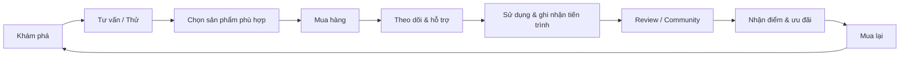
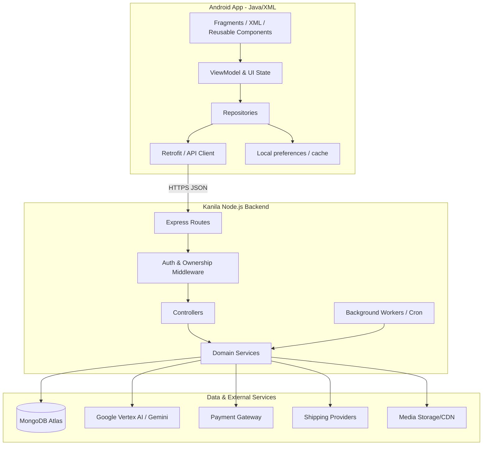
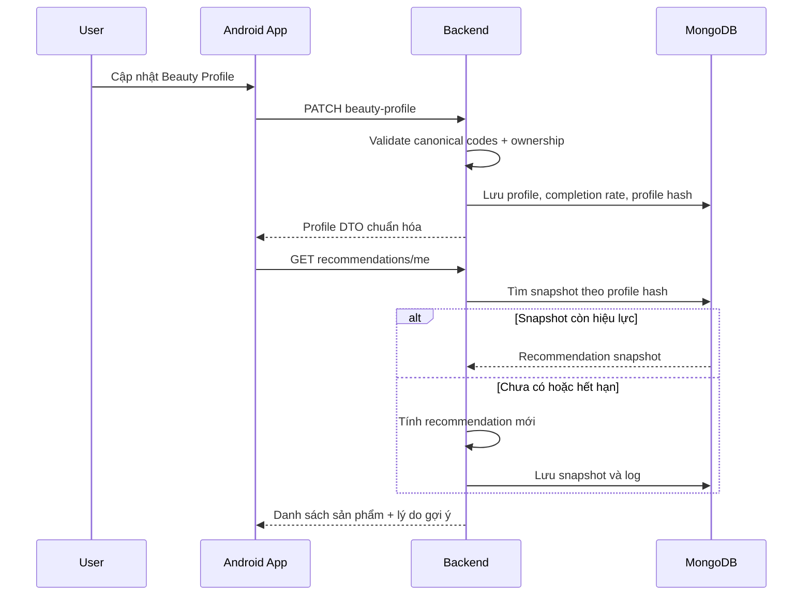
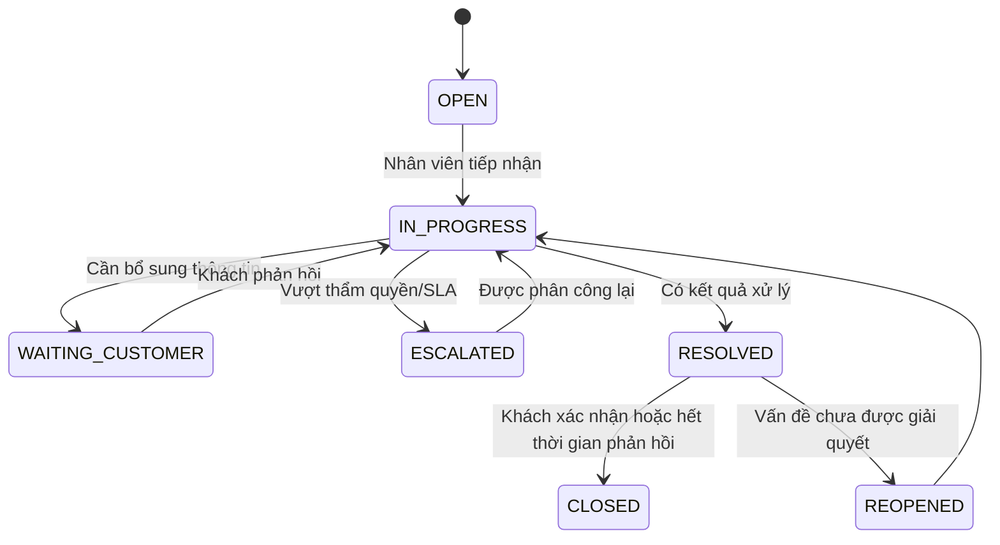
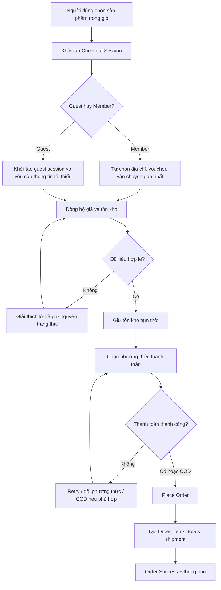
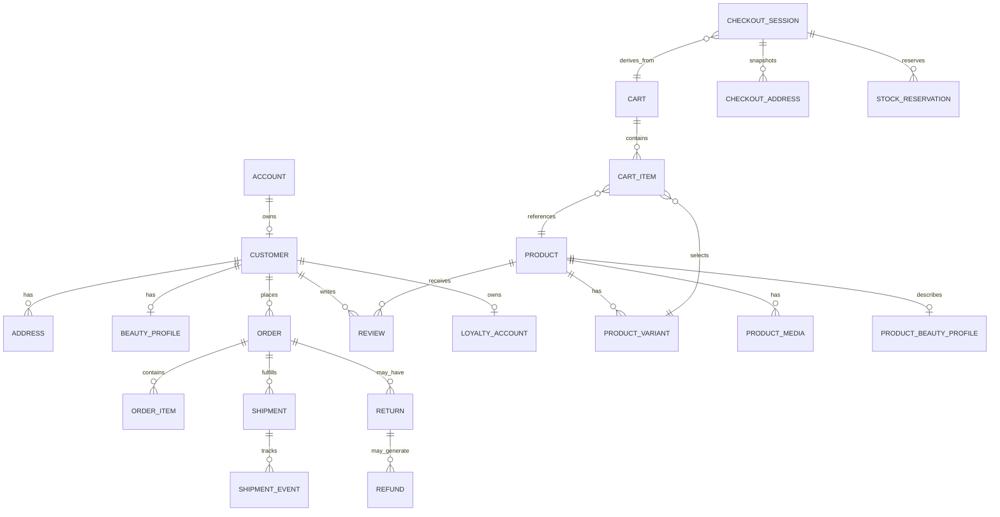

<div align="center">
  

# KANILA APP

### Nền tảng Beauty Commerce cá nhân hóa, tích hợp Community và Trợ lý hỗ trợ khách hàng thông minh

[](#công-nghệ-sử-dụng)
[](#công-nghệ-sử-dụng)
[](#kiến-trúc-dữ-liệu)
[](#vertex-ai--gemini)
[](#kiến-trúc-hệ-thống)
[](#bối-cảnh-đề-tài)

**Chọn đúng hơn · Mua nhanh hơn · Gắn kết lâu hơn**

</div>

> [!IMPORTANT]
> README này tổng hợp từ tài liệu phân tích thiết kế, báo cáo đồ án, đặc tả API, báo cáo model/database, hợp đồng Beauty Profile, đặc tả Skin Match & AI Review, cấu hình Vertex AI và các quyết định kỹ thuật đã thống nhất trong quá trình phát triển Kanila. Trạng thái tính năng được ghi theo bằng chứng trong tài liệu; một số module nâng cao đang ở mức thiết kế, prototype hoặc lộ trình, chưa được khẳng định là production-ready nếu chưa có kiểm thử trực tiếp trên mã nguồn triển khai.

---

## Mục lục

- [1. Tổng quan](#1-tổng-quan)
- [2. Bài toán và giá trị khác biệt](#2-bài-toán-và-giá-trị-khác-biệt)
- [3. Nhóm người dùng mục tiêu](#3-nhóm-người-dùng-mục-tiêu)
- [4. Phạm vi chức năng](#4-phạm-vi-chức-năng)
- [5. Giao diện minh họa](#5-giao-diện-minh-họa)
- [6. Kiến trúc thông tin và điều hướng](#6-kiến-trúc-thông-tin-và-điều-hướng)
- [7. Kiến trúc hệ thống](#7-kiến-trúc-hệ-thống)
- [8. Công nghệ sử dụng](#8-công-nghệ-sử-dụng)
- [9. Chi tiết module](#9-chi-tiết-module)
- [10. Beauty Profile và cá nhân hóa](#10-beauty-profile-và-cá-nhân-hóa)
- [11. Skin Match Score](#11-skin-match-score)
- [12. AI Review Summary](#12-ai-review-summary)
- [13. Chatbot, Support và Ticket](#13-chatbot-support-và-ticket)
- [14. AR Try-On và tìm kiếm đa phương thức](#14-ar-try-on-và-tìm-kiếm-đa-phương-thức)
- [15. Checkout, đơn hàng và đổi trả](#15-checkout-đơn-hàng-và-đổi-trả)
- [16. Backend API](#16-backend-api)
- [17. Kiến trúc dữ liệu](#17-kiến-trúc-dữ-liệu)
- [18. Design System](#18-design-system)
- [19. Cấu trúc dự án đề xuất](#19-cấu-trúc-dự-án-đề-xuất)
- [20. Cài đặt và chạy dự án](#20-cài-đặt-và-chạy-dự-án)
- [21. Seed dữ liệu](#21-seed-dữ-liệu)
- [22. Kiểm thử](#22-kiểm-thử)
- [23. Bảo mật và quyền riêng tư](#23-bảo-mật-và-quyền-riêng-tư)
- [24. Quy ước phát triển](#24-quy-ước-phát-triển)
- [25. Trạng thái, hạn chế và nợ kỹ thuật](#25-trạng-thái-hạn-chế-và-nợ-kỹ-thuật)
- [26. Lộ trình phát triển](#26-lộ-trình-phát-triển)
- [27. KPI đề xuất](#27-kpi-đề-xuất)
- [28. Bối cảnh đề tài và thành viên](#28-bối-cảnh-đề-tài-và-thành-viên)
- [29. Liên kết dự án](#29-liên-kết-dự-án)
- [30. Tài liệu nền](#30-tài-liệu-nền)

---

# 1. Tổng quan

**Kanila App** là ứng dụng thương mại điện tử mỹ phẩm trên Android, được định vị theo mô hình **Beauty Commerce** thay vì chỉ là một ứng dụng bán hàng thông thường.

Kanila kết hợp bốn lớp giá trị trong cùng một hành trình:

| Lớp giá trị | Nội dung chính |
|---|---|
| **Core Commerce** | Đăng nhập, tìm kiếm, danh mục, chi tiết sản phẩm, wishlist, giỏ hàng, voucher, checkout, thanh toán, đơn hàng và đổi trả. |
| **Beauty Intelligence** | Beauty Profile, Skin Match Score, Recommendation Engine, phân tích làn da, routine, Ingredient Checker và AI tổng hợp review. |
| **Social Commerce** | Community Feed, Blog, Reels, Challenge, review có thưởng, KOC/Creator, leaderboard và product tag. |
| **AI / AR / Support** | AI Assistant, hỗ trợ tra cứu đơn, ticket CSKH, human handoff, AR Try-On, voice search, image search và QR/barcode. |

Hành trình giá trị mục tiêu:



## Tuyên bố sản phẩm

> Kanila giúp người dùng không chỉ **tìm được mỹ phẩm**, mà còn **hiểu sản phẩm có phù hợp với làn da, tone da, nhu cầu, routine và ngân sách của mình hay không** trước khi ra quyết định mua.

---

# 2. Bài toán và giá trị khác biệt

## 2.1. Bài toán người dùng

Người mua mỹ phẩm trực tuyến thường gặp các rủi ro:

- Không biết sản phẩm có phù hợp với loại da và vấn đề da hay không.
- Khó chọn đúng màu son, kem nền hoặc phấn khi chưa thử trực tiếp.
- Review nhiều nhưng rời rạc, khó rút ra kết luận.
- Thiếu thông tin về thành phần, cách kết hợp routine và nguy cơ kích ứng.
- Checkout phức tạp, voucher khó hiểu, lỗi thanh toán làm mất trạng thái.
- Không biết đơn đang ở đâu hoặc phải liên hệ ai khi cần đổi trả.
- Thiếu động lực quay lại sau khi mua hàng.

## 2.2. Cách Kanila giải quyết

| Bài toán | Giải pháp Kanila | Giá trị nhận được |
|---|---|---|
| Sợ mua sai sản phẩm | Beauty Profile + Skin Match + Recommendation | Tăng độ tự tin trước khi mua. |
| Sợ sai màu makeup | AR Try-On + shade/variant data | Giảm rủi ro chọn sai màu. |
| Review quá nhiều | AI Review Summary | Nắm nhanh ưu, nhược điểm và kinh nghiệm sử dụng. |
| Không hiểu thành phần | Ingredient Checker + AI Assistant | Hỗ trợ người mới và người có da nhạy cảm. |
| Checkout nhiều bước | Checkout Session, tự chọn dữ liệu phù hợp, lưu trạng thái | Giảm bỏ giỏ và lỗi thao tác. |
| Hậu mãi không minh bạch | Order Timeline + Support Ticket + SLA | Biết rõ trạng thái và người xử lý. |
| Khó giữ chân người dùng | Skin Journey + Community + Reward + Loyalty | Tạo vòng lặp sử dụng dài hạn. |

## 2.3. Điểm mới nổi bật

1. **Beauty Profile là lõi dữ liệu xuyên suốt**, không chỉ là một form hồ sơ; dữ liệu được tái sử dụng ở Home, Search, Product Detail, Chatbot, Recommendation và Skin Match.
2. **Skin Match Score giải thích được**, hiển thị điểm, độ tin cậy, lý do phù hợp, cảnh báo và xung đột thay vì chỉ trả về “nên mua/không nên mua”.
3. **AI Review Summary chạy bất đồng bộ**, không làm chậm đường mua hàng và có trạng thái `PENDING`, `GENERATING`, `READY`, `STALE`, `FAILED`.
4. **Community được gắn trực tiếp với commerce**, cho phép product tag, shoppable Reels và review verified purchase.
5. **Support được thiết kế xuyên suốt trước–trong–sau mua**, không bị tách thành một trang FAQ bị động.
6. **Checkout có cơ chế bảo toàn trạng thái**, xử lý voucher hết lượt, hết hàng, địa chỉ không hỗ trợ và thanh toán thất bại mà không buộc người dùng làm lại từ đầu.
7. **Backend có nền dữ liệu thương mại điện tử tương đối sâu**, bao gồm giá, tồn kho, giữ hàng, thanh toán, shipment, return/refund, loyalty và audit.

---

# 3. Nhóm người dùng mục tiêu

| Nhóm người dùng | Nhu cầu chính | Tính năng ưu tiên |
|---|---|---|
| **Người mới skincare** | Không biết bắt đầu từ đâu, sợ mua sai | Beauty Profile, AI Assistant, routine cơ bản, Ingredient Checker |
| **Beauty lover** | Theo trend, thích thử và chia sẻ | Reels, Community, Challenge, AR Try-On, Reward |
| **Người mua makeup** | Sợ sai màu son/nền/phấn | AR Try-On, shade variant, review theo tone da |
| **Người có da nhạy cảm** | Quan tâm thành phần và kích ứng | Avoid Ingredients, cảnh báo xung đột, support nhanh |
| **Khách hàng trung thành** | Muốn mua lại nhanh và nhận ưu đãi | Loyalty, voucher wallet, refill reminder, repurchase |
| **Creator/KOC** | Đăng nội dung, tag sản phẩm, nhận thưởng/hoa hồng | Creator Center, Reels, product tag, moderation status |
| **Admin/CSKH** | Quản trị sản phẩm, đơn, hỗ trợ và nội dung | Web Admin, ticket, SLA, moderation, analytics |

---

# 4. Phạm vi chức năng

## 4.1. Ma trận ưu tiên

| Nhóm | Phạm vi | Ưu tiên |
|---|---|---:|
| Core commerce flow | Auth, catalog, product, cart, checkout, order, return/refund | **P0** |
| Chatbot tra cứu đơn | Trạng thái đơn, shipment, thanh toán, hoàn tiền | **P0** |
| Support ticket | Khiếu nại, đổi trả, SLA, escalation | **P0** |
| Beauty Profile | Hồ sơ da và sở thích làm đẹp | **P0/P1** |
| Community Feed | Bài đăng, tương tác, báo cáo vi phạm | **P1** |
| Review có thưởng | Verified purchase, media, reward | **P1** |
| Skin Journey | Tiến trình da, routine, reminder | **P1** |
| Reels mua hàng | Product tag, bottom sheet, thêm giỏ không gián đoạn | **P2** |
| AR Try-On | Thử son, má, mắt theo variant | **P2** |
| AI Assistant multimodal | Text, ảnh, voice, ingredient image | **P2/P3** |
| VR Beauty Room | Không gian làm đẹp ảo nâng cao | **P3** |

## 4.2. Trạng thái tổng hợp theo tài liệu

| Hạng mục | Bằng chứng hiện có | Trạng thái mô tả |
|---|---|---|
| Android UI/UX | Bộ màn hình và báo cáo giao diện | Thiết kế/prototype phong phú |
| Core commerce backend | 514 method-path entries trong inventory API | Nền API rộng, cần tiếp tục chuẩn hóa |
| Database | 72 active Mongoose models; audit và cleanup hoàn tất | Nền dữ liệu mạnh |
| Beauty Profile v2 | Contract FE–BE–DB rõ ràng | Đã chuẩn hóa, còn 1 blocker Gson null |
| Skin Match | DTO, status, match level và cache snapshot | Đặc tả backend hoàn chỉnh |
| AI Review | DTO, worker, Mongo lock, Vertex provider | Đã có thiết kế/triển khai backend theo tài liệu |
| Vertex AI | Config, verify, unit test và live test | Đã có hướng dẫn tích hợp |
| Community/Reels | BPMN, use case, UI và UX rules | Thiết kế sâu; backend cần xác nhận theo branch |
| AR Try-On | MVP và data mock theo variant | Prototype/lộ trình |
| Voice Search | Android `RecognizerIntent` | Kế hoạch triển khai |

---

# 5. Giao diện minh họa

<div align="center">
  
</div>

> Hình minh họa được tổng hợp từ các màn hình trong báo cáo dự án: Trang chủ cá nhân hóa, Beauty Profile, phân tích làn da AI, danh mục sản phẩm, Community/Challenge và Reels.

<details>
<summary><strong>Xem thêm các màn hình riêng lẻ</strong></summary>

<br/>

<table>
  <tr>
    <td align="center"><br/><b>Trang chủ</b></td>
    <td align="center"><br/><b>Beauty Profile</b></td>
    <td align="center"><br/><b>Phân tích làn da AI</b></td>
  </tr>
  <tr>
    <td align="center"><br/><b>Danh mục</b></td>
    <td align="center"><br/><b>Community</b></td>
    <td align="center"><br/><b>Reels</b></td>
  </tr>
</table>

</details>

---

# 6. Kiến trúc thông tin và điều hướng

## 6.1. Bottom Navigation

| Tab | Nội dung |
|---|---|
| **Trang chủ** | Banner, deal, gợi ý cá nhân hóa, sản phẩm mua lại, challenge và Reels nổi bật |
| **Danh mục** | Skincare, Makeup, Haircare, Bodycare, Fragrance, Men Beauty, Brand |
| **Reels/Community** | Feed, Reels, Challenge, Blog, Leaderboard và Reward |
| **Thông báo** | Đơn hàng, ưu đãi, tương tác, routine reminder và ticket |
| **Tài khoản** | Profile, Beauty Profile, đơn hàng, wishlist, voucher, loyalty và hỗ trợ |

## 6.2. Header và tìm kiếm

- Thanh tìm kiếm sản phẩm, thương hiệu và thành phần.
- Camera/image search để nhận diện sản phẩm hoặc bảng thành phần.
- Voice search để giảm thao tác nhập liệu.
- QR/barcode scan cho tra cứu nhanh hoặc kiểm tra nguồn gốc.
- Giỏ hàng và đơn hàng hiển thị badge trạng thái.

## 6.3. Floating Support

Các màn hình quan trọng như Product Detail, Cart, Checkout, Order Detail, Return/Refund, AR Try-On và Skin Journey đều cần có entry hỗ trợ.

Khi người dùng bấm floating button, app ưu tiên mở quick menu dạng bottom sheet:

- Hỏi AI Assistant.
- Tra cứu đơn gần nhất.
- Tạo yêu cầu hỗ trợ.
- Liên hệ nhân viên.
- Xem chính sách liên quan đến màn hình hiện tại.

---

# 7. Kiến trúc hệ thống



## 7.1. Nguyên tắc kiến trúc Android

- Java + XML, không sử dụng Jetpack Compose trong phạm vi hiện tại.
- MVVM-style separation.
- Fragment phụ trách bind UI, observe state và navigation nhẹ.
- ViewModel giữ UI state, gọi Repository và điều phối validation.
- Repository chịu trách nhiệm data source và API.
- Adapter không gọi API và không tự điều hướng.
- Mọi màn hình có dữ liệu phải xử lý: `loading`, `success`, `empty`, `error`, `no-internet`.

## 7.2. Nguyên tắc kiến trúc backend

- Controller chỉ xử lý request/response.
- Service chứa business logic.
- Model định nghĩa Mongoose schema.
- Validation kiểm tra input trước khi vào service.
- Middleware bảo vệ authentication, authorization và ownership.
- Worker xử lý tác vụ AI bất đồng bộ để không chặn request chính.
- Không trả raw error, stack trace hoặc secret về client.

---

# 8. Công nghệ sử dụng

## 8.1. Frontend

| Thành phần | Công nghệ |
|---|---|
| Nền tảng | Android |
| Ngôn ngữ | Java |
| UI | XML Layouts |
| Kiến trúc | MVVM-style |
| Networking | Retrofit hoặc API stack hiện hữu của dự án |
| Navigation | Fragment/MainActivity theo cấu trúc app hiện hữu |
| Voice Search | Android `RecognizerIntent` |
| AR MVP | Camera + face landmark/renderer phù hợp với Android implementation |

## 8.2. Backend

| Thành phần | Công nghệ |
|---|---|
| Runtime | Node.js — môi trường đã trao đổi: `22.20.0` |
| Framework | Express — `4.22.2` |
| Database | MongoDB Atlas |
| ODM | Mongoose — `8.23.0` |
| AI SDK | `@google/genai` |
| AI Provider | Google Vertex AI / Gemini |
| Background processing | Worker định kỳ với MongoDB lock |
| API style | REST/JSON |

## 8.3. Hạ tầng và công cụ

- Git/GitHub cho quản lý mã nguồn.
- Figma cho thiết kế UI.
- Draw.io cho BPMN, Use Case và ERD.
- Render, Railway, VPS hoặc nền tảng tương đương cho backend.
- MongoDB Atlas cho database cloud.
- Google Cloud Console cho Vertex AI API key và quota.

---

# 9. Chi tiết module

## Module 0 — Design System & Shared Components

Nền móng dùng chung cho toàn bộ app:

- Color tokens, typography, spacing, radius và semantic states.
- Button, input, search bar, icon button, checkbox, radio, chip, badge.
- Product Card, Cart Item, Voucher Card, Order Card, Price Summary, Status Chip.
- Post Card, Review Card, Comment Item, Reels Product Tag, Reward Card.
- Chat Bubble, Ticket Card, FAQ Item và Support Status Chip.
- Bottom Sheet, confirm dialog, error dialog.
- Loading, empty, error, no-internet và login-required states.

## Module 1 — Authentication & Onboarding

- Splash, onboarding, login, register và OTP.
- Guest browsing.
- Social provider linking khi backend hỗ trợ.
- Passwordless/email OTP theo hướng dữ liệu hiện tại.
- Contextual login: chỉ yêu cầu đăng nhập khi người dùng thực hiện hành động cần tài khoản.

## Module 2 — Beauty Profile

- Loại da, vấn đề da, độ nhạy cảm, màu da và undertone.
- Finish makeup, màu son, phong cách makeup.
- Ngân sách, texture, thành phần ưu tiên/tránh.
- Brand/category yêu thích và mục tiêu làm đẹp.
- Tính tỷ lệ hoàn thiện profile và `profile_hash` để kiểm soát snapshot.

## Module 3 — Home & Discovery

- Home cá nhân hóa theo Beauty Profile.
- Search theo tên, brand, danh mục, thành phần.
- Voice, image và QR/barcode search theo lộ trình.
- Sản phẩm mua lại, sản phẩm theo routine, deal và nội dung cộng đồng.

## Module 4 — Catalog & Product Detail

- Danh mục, brand, filter/sort bottom sheet.
- Variant/SKU, media, giá và tồn kho.
- Skin Match Score.
- AI Review Summary.
- Ingredient Checker.
- AR Try-On entry khi sản phẩm hỗ trợ.
- Sticky CTA “Thêm vào giỏ/Mua ngay”.

## Module 5 — Cart & Checkout

- Cart cho khách và thành viên.
- Đồng bộ giá/tồn kho.
- Voucher wallet và giải thích điều kiện voucher.
- Checkout Session, địa chỉ, vận chuyển, thanh toán và stock reservation.
- Retry payment, đổi phương thức hoặc chuyển COD khi phù hợp.

## Module 6 — Order, Return & Review

- Order list, order detail, timeline và shipment tracking.
- Hủy/mua lại/liên hệ hỗ trợ tùy trạng thái.
- Return request theo item, lý do và bằng chứng.
- Refund status và SLA.
- Review verified purchase, review media và helpful vote.

## Module 7 — Community & Reels

Community Home sử dụng cấu trúc tab:

- **Feed:** bài đăng, review, tương tác, comment, share, report.
- **Challenge:** thử thách, tiến độ, điểm thưởng, leaderboard.
- **Blog:** nội dung kiến thức làm đẹp.
- **Reels:** video ngắn, product tag và mua sắm không gián đoạn.

Quy tắc UX Reels:

- Thumbnail xuất hiện ngay, tránh màn hình đen.
- Chỉ một Reel được phát tại một thời điểm.
- Preload Reel tiếp theo nhưng giới hạn dữ liệu khi mạng yếu.
- Giữ vị trí feed và timestamp khi quay lại.
- Product bottom sheet không làm mất Reel hiện tại.
- Thêm giỏ thành công chỉ dùng snackbar/toast nhẹ.

## Module 8 — AR Try-On & Skin Journey

- AR permission với giải thích quyền riêng tư.
- Face guide và trạng thái không nhận diện được khuôn mặt.
- Thử màu son, má hoặc mắt theo variant.
- Lưu look/snapshot ở chế độ riêng tư mặc định.
- Skin Journey, progress log, routine và reminder.

## Module 9 — Chatbot & Support

- Quick intents.
- Product recommendation.
- Routine builder.
- Ingredient check.
- Order lookup.
- Policy Q&A.
- Ticket creation.
- Human handoff với tóm tắt ngữ cảnh.

## Module 10 — Account & Notification

- Account Hub.
- Edit profile, Beauty Profile và address book.
- Wishlist, voucher wallet, loyalty và point history.
- Notification Center, notification preferences và quiet hours.
- Privacy/security settings.

---

# 10. Beauty Profile và cá nhân hóa

Beauty Profile v2 là contract đồng bộ giữa Android, Backend API, Recommendation Engine và MongoDB.

## 10.1. Nhóm field chính

| Nhóm | JSON field tiêu biểu | Kiểu |
|---|---|---|
| Đặc điểm da | `skin_type`, `sensitivity_level`, `skin_color`, `skin_undertone` | Single-select, nullable |
| Makeup preference | `foundation_finish`, `lipstick_colors`, `makeup_styles` | Single/multi-select |
| Nhu cầu da | `skin_concerns`, `beauty_goals` | Multi-select |
| Thành phần | `avoid_ingredients`, `preferred_ingredients` | Multi-select |
| Mua sắm | `budget`, `preferred_brands`, `disliked_brands`, `preferred_categories`, `purchase_intent` | Single/multi-select |
| Trải nghiệm | `texture_preference`, `fragrance_preference` | Single/multi-select |
| Hệ thống | `profile_completion_rate`, `profile_hash`, `source` | Read-only |

## 10.2. Code chuẩn tiêu biểu

```text
skin_type: oily, dry, combination, normal, sensitive, unknown
sensitivity_level: low, medium, high, reactive, unknown
skin_tone: fair, light, medium, tan, deep, unknown
undertone: cool, warm, neutral, olive, unknown
budget_range: under_200k, 200_500k, 500_1000k, premium
```

## 10.3. PATCH semantics

| Payload | Ý nghĩa |
|---|---|
| Field bị bỏ qua | Giữ nguyên giá trị hiện tại |
| `field: null` | Xóa single-select nullable |
| `field: []` | Xóa toàn bộ lựa chọn multi-select |

> [!WARNING]
> Android Gson mặc định bỏ các field có giá trị `null`. Để người dùng có thể xóa một lựa chọn single-select, `ApiClient` cần dùng `GsonBuilder().serializeNulls()` hoặc custom serializer cho `UpdateBeautyProfileRequest`.

## 10.4. Recommendation flow



---

# 11. Skin Match Score

Endpoint đặc tả:

```http
GET /api/products/:id/skin-match/me
Authorization: Bearer <token>
```

## 11.1. Status

| Status | Ý nghĩa |
|---|---|
| `READY` | Điểm đã được tính và hợp lệ |
| `PROFILE_REQUIRED` | Chưa có Beauty Profile |
| `PROFILE_INCOMPLETE` | Hồ sơ thiếu dữ liệu quan trọng |
| `INSUFFICIENT_PRODUCT_DATA` | Sản phẩm thiếu thuộc tính canonical để đối chiếu |

## 11.2. Match level

- `EXCELLENT_MATCH`
- `GOOD_MATCH`
- `MODERATE_MATCH`
- `CAUTION`
- `INSUFFICIENT_DATA`

## 11.3. Dữ liệu trả về

- `score` và `match_level`.
- `confidence_score`.
- `profile_completion_rate`.
- `matching_data_completeness`.
- `reasons` và điểm đóng góp.
- `cautions`.
- `hard_conflicts`.
- `matched_attributes`.
- `generated_at` và `expires_at`.

<details>
<summary><strong>Ví dụ response rút gọn</strong></summary>

```json
{
  "success": true,
  "message": "Get skin match successfully",
  "data": {
    "status": "READY",
    "product_id": "60d5ec49f123456789012345",
    "score": 85,
    "match_level": "EXCELLENT_MATCH",
    "confidence_score": 90,
    "profile_completion_rate": 100,
    "matching_data_completeness": 80,
    "reasons": [
      {
        "code": "SKIN_TYPE_MATCH",
        "text": "Phù hợp với loại da của bạn",
        "contribution": 25
      }
    ],
    "cautions": [],
    "hard_conflicts": [],
    "matched_attributes": ["oily"]
  }
}
```

</details>

## 11.4. Nguyên tắc hiển thị

- Không dùng điểm cao để thay thế tư vấn y tế.
- Luôn hiển thị độ tin cậy và độ đầy đủ dữ liệu.
- Với `PROFILE_REQUIRED`, CTA dẫn trực tiếp đến Beauty Profile.
- Với `INSUFFICIENT_PRODUCT_DATA`, không tạo điểm giả có vẻ chính xác.
- Hard conflict phải nổi bật hơn lợi ích marketing.

---

# 12. AI Review Summary

Endpoint đặc tả:

```http
GET /api/products/:id/review-insights
```

## 12.1. Status

| Status | UI đề xuất |
|---|---|
| `PENDING` | “Đang chờ tổng hợp…” |
| `GENERATING` | “AI đang phân tích review…” |
| `READY` | Hiển thị summary và theme |
| `STALE` | Vẫn hiển thị dữ liệu, backend tái tạo nền |
| `FAILED` | Cho retry hoặc hiển thị review gốc |
| `INSUFFICIENT_REVIEWS` | Chưa đủ tối thiểu 5 review |

## 12.2. Nội dung insight

- `short_summary`.
- `positive_themes` và `negative_themes`.
- `common_experiences`.
- `usage_tips`.
- `cautions`.
- `sampled_review_count`.
- `generated_at`.

## 12.3. Worker architecture

`ReviewAiWorker` định kỳ truy vấn các bản ghi `PENDING` và `STALE`, sử dụng MongoDB lock `generation_lock_until` để tránh hai worker xử lý trùng.

Biến cấu hình:

```env
AI_REVIEW_WORKER_INTERVAL_MS=60000
```

Tắt worker:

```env
AI_REVIEW_WORKER_INTERVAL_MS=0
```

---

# 13. Chatbot, Support và Ticket

Kanila AI Assistant được thiết kế như một lớp **sales assistant + customer care**, không chỉ là FAQ bot.

## 13.1. Intent chính

| Intent | Ví dụ | Hành động |
|---|---|---|
| `product_recommendation` | “Da dầu mụn dùng kem nền nào dưới 500k?” | Kết hợp Beauty Profile, catalog, tồn kho và review để trả 3–5 gợi ý |
| `routine_builder` | “Tạo routine sáng cho da nhạy cảm” | Sinh routine theo thứ tự và giải thích cách dùng |
| `ingredient_check` | “Retinol có dùng chung BHA không?” | Kiểm tra tương tác và cảnh báo |
| `order_lookup` | “Đơn của tôi đang ở đâu?” | Đọc order, shipment event và ETA |
| `voucher_help` | “Mã này vì sao không dùng được?” | Giải thích rule và gợi ý voucher khác |
| `return_request` | “Tôi muốn đổi màu son” | Thu thập item, lý do, ảnh và tạo ticket/return |
| `human_handoff` | “Cho tôi gặp nhân viên” | Chuyển CSKH cùng tóm tắt ngữ cảnh |

## 13.2. Ticket lifecycle



Mỗi ticket cần hiển thị:

- Mã ticket.
- Loại vấn đề.
- Trạng thái.
- SLA dự kiến.
- Người/nhóm đang xử lý.
- Timeline sự kiện.
- File bằng chứng.
- Kết quả và CSAT.

---

# 14. AR Try-On và tìm kiếm đa phương thức

## 14.1. AR Try-On MVP

Phạm vi MVP nên ưu tiên makeup có vùng phủ rõ ràng:

- `LIPS` — son môi.
- `CHEEKS` — má hồng.
- `EYES` — màu mắt.

Ví dụ dữ liệu AR:

```json
{
  "product_id": "000000000000000000000fa1",
  "status": "active",
  "ar_type": "LIPS",
  "renderer_version": "v2",
  "variants": [
    {
      "variant_id": "var_01",
      "variant_name": "Light Neutral",
      "shade_hex": "#f2d6bf",
      "finish_type": "MATTE",
      "opacity": 0.7,
      "price": 199000,
      "in_stock": true,
      "enabled": true
    }
  ]
}
```

Nguyên tắc:

- Không tuyên bố màu AR chính xác tuyệt đối; ánh sáng, camera và màn hình có thể làm sai lệch.
- Snapshot riêng tư mặc định.
- Variant hết hàng không được CTA mua ngay.
- Có fallback swatch/media khi camera bị từ chối.

## 14.2. Voice Search

Quyết định MVP Android:

- Dùng `RecognizerIntent` của Android.
- Hiển thị dialog nhận diện giọng nói mặc định của hệ thống.
- Không cần app tự giữ luồng ghi âm riêng trong MVP.
- Kết quả voice được chuyển thành text và đưa vào search pipeline hiện có.

## 14.3. Image và QR Search

Lộ trình:

- Chụp sản phẩm để tìm sản phẩm tương tự.
- Chụp bảng thành phần để AI/knowledge base phân tích.
- Scan QR/barcode để tra cứu sản phẩm, biến thể hoặc tính chính hãng.

---

# 15. Checkout, đơn hàng và đổi trả

## 15.1. Checkout end-to-end



## 15.2. Ngoại lệ quan trọng

| Tình huống | Cách xử lý |
|---|---|
| Thanh toán thất bại | Không xóa session; cho retry, đổi phương thức hoặc COD |
| Địa chỉ không hỗ trợ | Nêu rõ lý do và gợi ý địa chỉ/phương thức khác |
| Voucher hết lượt | Tự bỏ voucher, tính lại tổng tiền và giải thích |
| Hết hàng | Cho giảm số lượng còn tồn hoặc chuyển wishlist |
| Giá thay đổi | Hiển thị giá cũ/mới và yêu cầu xác nhận |
| Mạng gián đoạn | Giữ session và phục hồi khi quay lại |

## 15.3. Theo dõi đơn

Timeline tiêu biểu:

```text
PENDING → CONFIRMED → PROCESSING → PACKED → SHIPPED → IN_TRANSIT → DELIVERED
```

Các thao tác phải phụ thuộc trạng thái:

- Hủy đơn trước khi xử lý/giao theo rule.
- Theo dõi shipment event.
- Liên hệ CSKH.
- Yêu cầu đổi trả sau khi nhận.
- Mua lại.
- Đánh giá sau thời gian hợp lý, không spam ngay khi vừa giao skincare.

## 15.4. Return/Refund

- Chọn item cần trả.
- Chọn lý do và số lượng.
- Upload ảnh/video bằng chứng.
- Hiển thị điều kiện đủ/không đủ.
- Tạo request code.
- Theo dõi approval, nhận hàng trả, kiểm tra và hoàn tiền.
- Mọi bước có SLA và trạng thái minh bạch.

---

# 16. Backend API

## 16.1. Tổng quan inventory

Tài liệu API hiện liệt kê **514 method-path entries**:

| Method | Số lượng |
|---|---:|
| GET | 241 |
| POST | 96 |
| DELETE | 77 |
| PUT | 53 |
| PATCH | 47 |

Inventory bao phủ các domain:

- Auth, account, customer và address.
- Beauty Profile và recommendation.
- Brand, category, product, option, variant và media.
- Price book, promotion, coupon và redemption.
- Cart, cart item, guest session và checkout session.
- Inventory, stock reservation và warehouse.
- Order, order item, status history và totals.
- Payment intent, method và transaction.
- Shipment và shipment events.
- Return/refund.
- Review, review media, vote và summary.
- Wishlist và loyalty.
- Admin operations và analytics.

## 16.2. Endpoint tiêu biểu

```http
POST   /api/auth/register
POST   /api/auth/login
POST   /api/auth/verify-otp
GET    /api/auth/me

GET    /api/products
GET    /api/products/:id
GET    /api/catalog
GET    /api/catalog/facets

GET    /api/accounts/skin-profile
PATCH  /api/accounts/skin-profile
GET    /api/customers/:customer_id/beauty-profile
PATCH  /api/customers/:customer_id/beauty-profile

POST   /api/checkout-sessions/me
POST   /api/checkout-sessions/me/buy-now
PATCH  /api/checkout-sessions/:id
POST   /api/checkout-sessions/:id/place-order

GET    /api/recommendations/me
GET    /api/recommendations/me/homepage
GET    /api/recommendations/me/all
POST   /api/recommendations/preview
```

Feature-specific contracts bổ sung:

```http
GET /api/products/:id/skin-match/me
GET /api/products/:id/review-insights
```

## 16.3. Response envelope

```json
{
  "success": true,
  "message": "OK",
  "data": {},
  "error": null
}
```

## 16.4. Lưu ý API

- Inventory hiện có nhiều alias singular/plural như `/api/account` và `/api/accounts`, `/api/customer` và `/api/customers`, `/api/wishlist` và `/api/wishlists`.
- Một số CRUD route trong tài liệu có handler name lặp hoặc chưa thể hiện đúng action; cần audit route-controller mapping trước production.
- Các endpoint setup/migration dạng anonymous phải được xóa, khóa hoặc bảo vệ trong môi trường production.
- `PUT` cho Beauty Profile đã được định hướng loại bỏ/405 trong contract mới; ưu tiên `POST` tạo và `PATCH` cập nhật.

---

# 17. Kiến trúc dữ liệu

## 17.1. Quy mô hiện tại

Báo cáo model mới nhất ghi nhận:

- **72 active Mongoose models**.
- **72 MongoDB collections**.
- Phần lớn collection sử dụng explicit snake_case mapping.
- Database audit đã hoàn tất fix tên collection, reseed và cleanup các collection ghost/legacy.

> Snapshot data dictionary cũ có 69 model và 117 quan hệ; khi sử dụng làm tài liệu tham khảo cần ưu tiên model report mới nhất vì schema đã được mở rộng và chuẩn hóa tiếp.

## 17.2. Nhóm domain

| Domain | Model/collection tiêu biểu |
|---|---|
| Auth & Access | `accounts`, `account_auth_providers`, `roles`, `permissions`, `account_roles`, `role_permissions`, `email_otps` |
| Customer | `customer_profiles`, `customer_addresses`, `customer_consents`, `customer_preferences`, `customer_beauty_profiles` |
| Catalog | `brands`, `categories`, `products`, `product_media`, `product_attributes`, `product_options`, `product_option_values`, `product_variants` |
| Beauty Intelligence | `beauty_references`, `product_beauty_profiles`, `customer_recommendation_snapshots`, `recommendation_logs` |
| Pricing & Promotion | `price_books`, `price_book_entries`, `price_histories`, `promotions`, `promotion_rules`, `promotion_targets`, `coupons` |
| Cart & Checkout | `guest_sessions`, `carts`, `cart_items`, `checkout_sessions`, `checkout_addresses`, `checkout_shipping_methods`, `stock_reservations` |
| Order & Fulfillment | `orders`, `order_items`, `order_totals`, `order_status_history`, `shipments`, `shipment_events`, `shipment_items` |
| Payment & Return | `payment_intents`, `payment_methods`, `payment_transactions`, `returns`, `returnitems`, `refunds` |
| Engagement | `reviews`, `review_medias`, `review_summaries`, `review_votes`, `wishlists`, `wishlist_items` |
| Loyalty | `loyalty_accounts`, `loyalty_point_ledger`, `loyalty_tiers`, `customer_coupons` |
| Operations | `warehouses`, `inventory_balances`, `inventory_transactions`, `audit_logs` |

## 17.3. Database audit đã hoàn tất

- 28 model được bổ sung explicit `collection:` mapping.
- Full seed được chạy lại vào canonical snake_case collections.
- 47 orphan/legacy collections được cleanup.
- `addresses`, `customers` và `password_reset_otps` legacy đã được loại bỏ.
- Backend boot thành công sau cleanup.
- Seeded data không chứa `password_hash`.

## 17.4. Quan hệ nghiệp vụ trọng tâm



---

# 18. Design System

## 18.1. Brand colors

| Token | Hex | Vai trò |
|---|---:|---|
| `primary` | `#FFADBE` | CTA chính, active state, brand highlight |
| `secondary` | `#FFD6DE` | Chip, voucher, selected soft background |
| `accent_dark` | `#6B1E2E` | Heading, giá, premium emphasis |
| `button` | `#E83E72` | Strong CTA |
| `background_main` | `#FFFFFF` | Nền chính |
| `background_sub` | `#FDF9FB` | Card/section nền nhẹ |
| `text_main` | `#372B2B` | Text chính |
| `border_divider` | `#D9D9D9` | Border/divider |
| `success` | `#2E9D62` | Trạng thái thành công |
| `error` | `#D64545` | Trạng thái lỗi |

## 18.2. Typography

Font chính: **Nunito**.

| Style | Size | Weight | Dùng cho |
|---|---:|---|---|
| H1 | 24sp | Bold | Onboarding/campaign title |
| H2 | 20sp | Bold/SemiBold | Screen title, product name |
| H3 | 16sp | SemiBold | Card title, tab, button |
| Body | 14sp | Regular | Nội dung chính |
| Caption | 12sp | Regular/Medium | Trạng thái, thông tin phụ |
| Micro | 10sp | Medium | Badge và tag nhỏ |

## 18.3. Golden rules

- Luôn kiểm tra `res/` trước khi tạo resource mới.
- Không hardcode màu, font, spacing nếu đã có token.
- Không tạo duplicate color/drawable/style.
- Không xây one-off component nếu Module 0 đã có component dùng chung.
- Không đưa business logic nặng vào Fragment/XML.
- Không bỏ qua loading/empty/error/no-internet states.
- Critical commerce screen luôn có support entry.

---

# 19. Cấu trúc dự án đề xuất

> Cấu trúc dưới đây là cấu trúc chuẩn hóa theo rulebook; repository thực tế có thể đang dùng tên thư mục khác. Khi áp dụng, ưu tiên giữ cấu trúc hiện hữu và refactor có kiểm soát.

```text
KanilaApp/
├── mobile-android/
│   └── KanilaApp/
│       ├── app/
│       │   └── src/main/
│       │       ├── java/com/kanila/app/
│       │       │   ├── common/
│       │       │   ├── data/
│       │       │   │   ├── api/
│       │       │   │   ├── model/
│       │       │   │   └── repository/
│       │       │   └── ui/
│       │       │       ├── auth/
│       │       │       ├── beauty_profile/
│       │       │       ├── home/
│       │       │       ├── product/
│       │       │       ├── commerce/
│       │       │       ├── order/
│       │       │       ├── community/
│       │       │       ├── ar/
│       │       │       ├── support/
│       │       │       └── account/
│       │       └── res/
│       │           ├── layout/
│       │           ├── drawable/
│       │           ├── font/
│       │           ├── navigation/
│       │           └── values/
│       └── build.gradle
│
├── backend/
│   ├── server.js
│   ├── package.json
│   ├── .env.example
│   ├── config/
│   ├── controllers/
│   ├── middleware/
│   ├── models/
│   ├── routes/
│   ├── services/
│   │   ├── ai/
│   │   ├── reviewAi/
│   │   ├── skinMatch/
│   │   └── recommendation/
│   ├── cron/
│   ├── scripts/
│   └── tests/
│
├── docs/
│   ├── diagrams/
│   ├── api/
│   ├── database/
│   └── ui/
└── README.md
```

---

# 20. Cài đặt và chạy dự án

## 20.1. Clone repository

```bash
git clone https://github.com/trinhanh2604bn/KanilaApp.git
cd KanilaApp
```

## 20.2. Android App

Yêu cầu:

- Android Studio phiên bản tương thích với Gradle của repository.
- JDK theo cấu hình Gradle hiện hữu.
- Android SDK và emulator/device.

Thực hiện:

1. Mở thư mục Android bằng Android Studio.
2. Chờ Gradle Sync hoàn tất.
3. Kiểm tra API base URL trong cấu hình hiện hữu.
4. Chạy app trên emulator hoặc thiết bị thật.
5. Không đặt Vertex/Gemini key trong `strings.xml`, `BuildConfig` hoặc assets.

## 20.3. Backend

```bash
cd backend
npm install
cp .env.example .env
```

Các biến tối thiểu theo tài liệu được cung cấp:

```env
# Database
MONGODB_URI=mongodb+srv://...

# Vertex AI
VERTEX_API_KEY=your_key_here
VERTEX_GEMINI_MODEL=gemini-2.5-flash

# AI Review Worker
AI_REVIEW_WORKER_INTERVAL_MS=60000
```

Các secret auth/payment/email khác phải lấy từ `.env.example` thực tế của branch và **không commit**.

Chạy backend theo script trong `package.json`:

```bash
npm start
```

Hoặc development script nếu repository có khai báo:

```bash
npm run dev
```

## 20.4. Vertex config verification

```bash
npm run verify:vertex
npm run test:vertex:unit
```

Live smoke test — có tiêu tốn quota nhỏ:

```bash
npm run test:vertex:live
```

---

# 21. Seed dữ liệu

## 21.1. Product catalog seed

File `dataproduct_copy.js` tạo dữ liệu mapped ObjectId cho:

- 50 brands.
- 50 categories.
- 50 products.
- 50 product beauty profiles.
- 100 product media.
- 250 product attributes.
- 100 product variants.
- Option/value, variant media và variant option mappings.

Chạy:

```bash
node dataproduct_copy.js
```

Reset deterministic seed:

```bash
node dataproduct_copy.js --reset
```

## 21.2. Remaining business data

Chạy sau product seed:

```bash
node dataremaining.js
```

File này tạo dữ liệu mapped cho Auth, Customer, Cart, Checkout, Order, Payment, Inventory, Promotion, Loyalty, Shipment, Return/Refund, Wishlist, Review, Recommendation và Audit.

Reset batch:

```bash
node dataremaining.js --reset
```

Tạo thêm consumed OTP rows chỉ để kiểm tra database visual:

```bash
node dataremaining.js --include-runtime-otp
```

> OTP là runtime data; không nên seed mặc định trong môi trường bình thường.

---

# 22. Kiểm thử

## 22.1. Backend

```bash
npm test
npm run verify:vertex
npm run test:vertex:unit
```

Live Vertex test:

```bash
npm run test:vertex:live
```

## 22.2. Test suite đề xuất

| Nhóm | Test cần có |
|---|---|
| Auth | OTP expiry, account lock, provider link, ownership |
| Beauty Profile | Canonical code validation, PATCH omitted/null/[] |
| Recommendation | Snapshot hit/miss, profile hash, inventory filter |
| Skin Match | Profile missing/incomplete, hard conflict, insufficient product data |
| AI Review | PENDING→READY, stale refresh, lock collision, retry/failure |
| Cart | Guest/member, merge cart, price change, stock shortage |
| Checkout | Session recovery, voucher invalidation, payment retry, idempotency |
| Order | State transition, shipment event, invalid action by status |
| Return/Refund | Eligibility, evidence, SLA, amount calculation |
| Security | IDOR, unauthorized route, sensitive field leak, rate limit |

## 22.3. UI acceptance checklist

- Không có hardcoded color/font/spacing không cần thiết.
- Loading/empty/error/no-internet đầy đủ.
- CTA không bị che bởi keyboard hoặc navigation bar.
- Product variant bắt buộc được chọn trước add-to-cart.
- Checkout không làm mất dữ liệu khi lỗi.
- Support entry xuất hiện ở màn hình quan trọng.
- TalkBack/content description và touch target hợp lý.

---

# 23. Bảo mật và quyền riêng tư

## 23.1. Secret management

Tuyệt đối không:

- Đặt `VERTEX_API_KEY` trong Android.
- Commit `.env`, API key, token, service-account JSON hoặc credential.
- Trả raw Vertex response/error về client.

`.gitignore` nên giữ:

```gitignore
.env
.env.*
!.env.example
local.properties
node_modules/
build/
```

## 23.2. API security

- Enforce ownership từ token; không tin `customer_id` do client tự gửi.
- Trả `403` khi truy cập tài nguyên của khách khác.
- Bật Mongoose validation cho cập nhật profile.
- Sanitize error và ẩn field nhạy cảm.
- Dùng idempotency cho place-order/payment callback.
- Rate-limit auth, AI và endpoint tốn tài nguyên.
- Audit admin actions.

## 23.3. Beauty data privacy

- Beauty Profile, Skin Journey, AR snapshot và chat history là dữ liệu cá nhân cần quản lý consent.
- Ảnh AR/Skin Journey riêng tư mặc định.
- Cho phép xóa dữ liệu và thu hồi consent.
- Không đưa chẩn đoán y khoa; cảnh báo người dùng tìm chuyên gia khi có triệu chứng nghiêm trọng.

---

# 24. Quy ước phát triển

## 24.1. Branch

```text
main       = stable/submission
develop    = integration
feature/*  = tính năng
fix/*      = sửa lỗi
```

Ví dụ:

```text
feature/KAN-05-checkout-session
feature/KAN-09-chatbot-order-lookup
fix/KAN-02-beauty-profile-null-serialization
```

## 24.2. Commit

```text
feat: add skin match card
fix: enforce beauty profile ownership
ui: reuse product card component
refactor: move checkout logic to service
docs: update vertex setup
test: add review worker lock tests
```

## 24.3. Quy trình cho AI Agent/Developer

Trước khi code Android UI:

1. Đọc project rulebook.
2. Kiểm tra project structure.
3. Audit `res/values`, `res/font`, `res/drawable`, `res/layout`, `res/navigation`.
4. Tái sử dụng resource/component hiện hữu.
5. Liệt kê file sẽ tạo/sửa.
6. Chỉ sửa đúng scope.
7. Chạy test và cung cấp screenshot/video khi thay đổi UI.

---

# 25. Trạng thái, hạn chế và nợ kỹ thuật

## 25.1. Blocker đã xác định

### Gson null serialization

Android hiện có nguy cơ không gửi `null` khi PATCH Beauty Profile. Cần:

```java
Gson gson = new GsonBuilder()
        .serializeNulls()
        .create();

Retrofit retrofit = new Retrofit.Builder()
        .addConverterFactory(GsonConverterFactory.create(gson))
        // ...
        .build();
```

## 25.2. API cleanup

- Hợp nhất alias singular/plural.
- Audit handler mapping cho CRUD routes.
- Loại bỏ deprecated auth/reset endpoints.
- Khóa `/api/setup/*` và `/api/migrate-fields*` trong production.
- Chuẩn hóa `review_summary`/`review_summaries` nhất quán trên model, seed và route.

## 25.3. Module scope chưa đồng đều

- Core commerce và data layer có độ phủ cao hơn Community/Support/AR.
- Community/Reels có BPMN và UI sâu nhưng cần xác nhận API/model implementation trên branch hiện tại.
- AR mới phù hợp MVP, chưa nên cam kết độ chính xác màu production.
- Voice Search dùng dialog hệ thống; custom in-app voice UI là phase sau.

## 25.4. AI limitations

- AI Review cần tối thiểu 5 review.
- Model output phải được parse/validate; không tin raw JSON.
- AI recommendation phải lọc tồn kho, trạng thái sản phẩm và hard conflict trước khi hiển thị.
- Không để AI tự ý thay đổi giá, voucher, đơn hàng hoặc refund.

---

# 26. Lộ trình phát triển

## Giai đoạn 1 — Commerce Foundation

- Hoàn thiện Auth, Home, Catalog, Product Detail, Cart, Checkout, Order.
- Chuẩn hóa API envelope và route aliases.
- Hoàn tất Design System và shared components.
- Bổ sung monitoring, logging, security và test.

## Giai đoạn 2 — Beauty Intelligence

- Beauty Profile v2 end-to-end.
- Recommendation snapshot.
- Skin Match Score.
- AI Review Summary.
- Ingredient Checker và routine cơ bản.
- Skin Journey và notification reminder.

## Giai đoạn 3 — Social & Immersive Commerce

- Community Feed, Blog, Challenge và reward.
- Reels playback, creator upload và shoppable Reels.
- Moderation/reporting.
- AR Try-On cho son trước, sau đó má và mắt.
- Voice/image/QR search.

## Giai đoạn 4 — Beauty Ecosystem

- Creator/KOC affiliate.
- Live consultation.
- Subscription/refill.
- Gift Set Builder.
- Virtual Beauty Room.
- Staff app và nâng cấp admin analytics.

---

# 27. KPI đề xuất

| Mục tiêu | KPI |
|---|---|
| Tăng conversion | Product View→Cart, Add-to-Cart Rate, Checkout Completion, Payment Success |
| Tăng chất lượng gợi ý | Recommendation CTR, Skin Match engagement, conversion by match level |
| Giảm rủi ro mua sai | Return Rate, shade-related returns, complaint rate |
| Tăng giữ chân | D7/D30 retention, active days, repeat purchase, refill conversion |
| Tăng UGC | Post/review/reel volume, creator active rate, verified review rate |
| Tăng hiệu quả support | First Response Time, Resolution Time, SLA compliance, CSAT, reopen rate |
| Tăng loyalty | Earn/burn ratio, tier progression, voucher redemption |
| Hiệu quả AI | AI latency, READY rate, failure/retry rate, helpfulness feedback |

---

# 28. Bối cảnh đề tài và thành viên

## 28.1. Bối cảnh

- **Trường:** Trường Đại học Kinh tế - Luật, ĐHQG TP.HCM.
- **Khoa:** Hệ thống Thông tin.
- **Môn học:** Phát triển Thương mại Di động.
- **Học kỳ:** III/2025–2026.
- **Giảng viên hướng dẫn:** ThS. Nguyễn Quang Phúc.
- **Tên đề tài:** *Phát triển ứng dụng thương mại điện tử mỹ phẩm Kanila tích hợp cộng đồng tương tác và trợ lý hỗ trợ khách hàng thông minh.*

## 28.2. Thành viên

| STT | Họ và tên | MSSV |
|---:|---|---|
| 1 | Lê Thúy Thanh Trúc | K234111375 |
| 2 | Nguyễn Vũ Gia Ngân | K234111350 |
| 3 | Trịnh Thị Ngọc Ánh | K234111321 |
| 4 | Nguyễn Hoàng Gia Bảo | K234111323 |
| 5 | Nguyễn Minh Phú | K234111360 |

---

# 29. Liên kết dự án

- **GitHub:** https://github.com/trinhanh2604bn/KanilaApp
- **Figma:** https://www.figma.com/design/mT3l8zt1q6uZaUtPjMIXS7/WEB?node-id=0-1&p=f&t=bm8NW73LKp5Bqj0i-0
- **Draw.io:** https://drive.google.com/file/d/1sM8nM9GUcP-g5L4Xoxd_6Mu4Zdl3vJxg/view?usp=sharing
- **Google Drive:** https://drive.google.com/drive/folders/1-L0XpzACWMG-IJ31VbW6JzRIrsEyAVdr

---

# 30. Tài liệu nền

README được tổng hợp từ các nguồn nội bộ sau:

- `Phan_tich_thiet_ke_APP_Kanila_final.docx`
- `Report_Nhóm 8.pdf`
- `KANILA_AGENT_RULES.md`
- `api_documentation.md`
- `models-report.md`
- `database-audit-report.md`
- `kanila_database_schema_dictionary.xlsx`
- `beauty-profile-contract-v2.md`
- `SKIN_MATCH_AND_AI_REVIEW_BACKEND.md`
- `VERTEX_AI_SETUP.md`
- `dataproduct_copy.js`
- `dataremaining.js`
- Bộ BPMN/Use Case/ERD và các quyết định kỹ thuật trong quá trình trao đổi dự án.

---

## License

Chưa xác định. Trước khi public repository, nhóm cần bổ sung file `LICENSE` phù hợp với mục đích học thuật, demo hoặc thương mại.

---

<div align="center">

**KANILA — Discover · Match · Try · Shop · Share · Reward**

</div>
